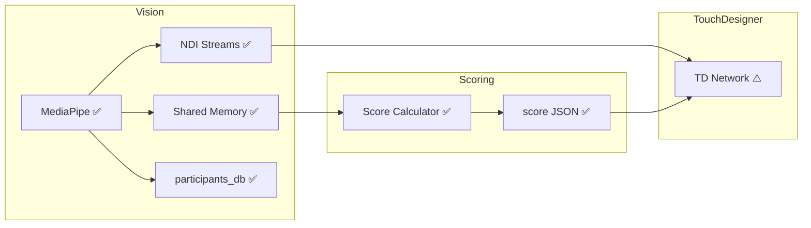

# Session Handoff

**Last updated:** 2026-01-13 00:30

> **Commands:** "spin up" / "spin down" → see `AGENT_0_SHARED.md`  
> **Agent roster:** see `AGENT_0_SHARED.md`

## Quick Start Commands

```bash
cd PyBas3

# Run the full system (Vision + Scoring + Dashboard)
uv run python orchestrator.py --dashboard

# Run without dashboard
uv run python orchestrator.py

# Keep participants across restarts
uv run python orchestrator.py --dashboard --persist

# Run integration tests
uv run python tests/test_integration.py

# Run individual modules
uv run python mediapipe/multi_person_detector.py
uv run python scoring/pose_scorer.py
uv run python mediapipe/live_dashboard.py
```

## Architecture Status (as of: <!-- YYYY-MM-DD -->)



**Legend:** ✅ done | ⚠️ partial | ❌ not started

## What changed last session
- 🔄 Orchestrator: Created `orchestrator.py` launcher script
- 🔄 Orchestrator: Simplified `live_dashboard.py` (shows thumbnails + scores, removed redundant zone config window)
- 📝 Added Quick Start Commands section to SESSION.md

## Current state
- **👁️ Iris**: MediaPipe detection + pHash + shared memory + per-participant NDI streams ✅; zone UI with sliders + click-to-set ✅
- **🎯 Judge**: Scoring module complete (reader + scorer + JSON writer) ✅
- **🎨 Canvas**: TD helper scripts complete; needs GUI integration in TouchDesigner

## Tasks

### Backlog
- 🎨 TouchDesigner GUI integration (wire up helper scripts)

### In Progress
- <!-- none -->

### Done
- ✅ Migration: pre_render scripts + TD project from archive
- ✅ 👁️ MediaPipe multi-person detection + pHash UUIDs
- ✅ 👁️ SharedMemoryPoseWriter (writes to shared memory for Scoring)
- ✅ 🎯 Shared memory reader + score calculator
- ✅ 🎯 Per-UUID score JSON writer
- ✅ Common module: shared protocols & constants (`common/protocols.py`, `common/shared_memory.py`)
- ✅ 🎨 TD: NDI stream discovery + UUID parsing (`td_scripts/ndi_discovery.py`)
- ✅ 🎨 TD: Score JSON file watcher (`td_scripts/score_watcher.py`)
- ✅ 🎨 TD: Unified ParticipantManager (`td_scripts/td_participant_manager.py`)
- ✅ UV package manager setup (`pyproject.toml`)
- ✅ 🔄 Integration tests (`tests/test_integration.py`) - all 4 passing
- ✅ 👁️ Per-participant NDI streams (`BAS_Participant_<UUID>`)
- ✅ 👁️ Zone UI: sliders + click-to-set corners + Z-depth visualization
- ✅ 🔄 Launcher script (`orchestrator.py`) - starts Vision + Scoring + optional Dashboard

## Blockers
- <!-- delete when resolved -->
