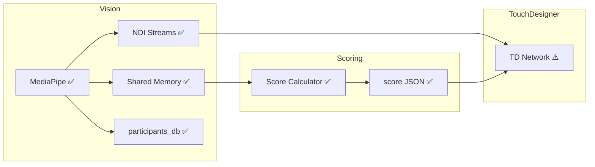

# Session Handoff

**Last updated:** 2026-01-12 23:50

> **Commands:** "spin up" / "spin down" → see `AGENT_0_SHARED.md`  
> **Agent roster:** see `AGENT_0_SHARED.md`

## Architecture Status (as of: <!-- YYYY-MM-DD -->)

**Legend:** ✅ done | ⚠️ partial | ❌ not started

## What changed last session
- 🔄 Orchestrator: Fixed NDI API (`FindCreate`, `video_frame.data`) in `ndi_streamer.py`
- 🔄 Orchestrator: Per-participant NDI streams working (`BAS_Participant_<UUID>`)
- 👁️ Iris: Zone UI integrated into main detector window (sliders + click-to-set corners)
- 👁️ Iris: Z-depth visualization (shows avg Z per person, green/red in/out indicator)
- 👁️ Iris: Segmentation mask tuned for tighter body contour fit
- 👁️ Iris: Added `--persist` flag (default clears participants/scores on startup)
- 📝 Removed all git commit instructions from rules/docs

## Current state
- **👁️ Iris**: MediaPipe detection + pHash + shared memory + per-participant NDI streams ✅; zone UI with sliders + click-to-set ✅
- **🎯 Judge**: Scoring module complete (reader + scorer + JSON writer) ✅
- **🎨 Canvas**: TD helper scripts complete; needs GUI integration in TouchDesigner

## Tasks

### Backlog
- 🎨 TouchDesigner GUI integration (wire up helper scripts)

### In Progress
- <!-- none -->

### Done
- ✅ Migration: pre_render scripts + TD project from archive
- ✅ 👁️ MediaPipe multi-person detection + pHash UUIDs
- ✅ 👁️ SharedMemoryPoseWriter (writes to shared memory for Scoring)
- ✅ 🎯 Shared memory reader + score calculator
- ✅ 🎯 Per-UUID score JSON writer
- ✅ Common module: shared protocols & constants (`common/protocols.py`, `common/shared_memory.py`)
- ✅ 🎨 TD: NDI stream discovery + UUID parsing (`td_scripts/ndi_discovery.py`)
- ✅ 🎨 TD: Score JSON file watcher (`td_scripts/score_watcher.py`)
- ✅ 🎨 TD: Unified ParticipantManager (`td_scripts/td_participant_manager.py`)
- ✅ UV package manager setup (`pyproject.toml`)
- ✅ 🔄 Integration tests (`tests/test_integration.py`) - all 4 passing
- ✅ 👁️ Per-participant NDI streams (`BAS_Participant_<UUID>`)
- ✅ 👁️ Zone UI: sliders + click-to-set corners + Z-depth visualization

## Blockers
- <!-- delete when resolved -->
