# Session Handoff

**Last updated:** 2026-01-12 15:00

> **Commands:** "spin up" → claim task & start | "spin down" → update this doc & commit

## Agent Roster
| Emoji | Nickname | Lane |
|-------|----------|------|
| 👁️ | Iris | Vision (MediaPipe → NDI + shared mem) |
| 🎯 | Judge | Scoring (pose → score JSON) |
| 🎨 | Canvas | TouchDesigner (NDI + JSON → visuals) |

```mermaid
flowchart LR
    subgraph Vision
        MP["MediaPipe ✅"]
        NDI["NDI Streams ⚠️"]
        SHM["Shared Memory ✅"]
        DB["participants_db ✅"]
        MP --> NDI
        MP --> SHM
        MP --> DB
    end
    
    subgraph Scoring
        SC["Score Calculator ✅"]
        JSON["score JSON ✅"]
        SHM --> SC
        SC --> JSON
    end
    
    subgraph TouchDesigner
        TDN["TD Network ❌"]
        NDI --> TDN
        JSON --> TDN
    end
```

## Architecture Status (as of: <!-- YYYY-MM-DD -->)

**Legend:** ✅ done | ⚠️ partial | ❌ not started

## What changed last session
- 👁️ Iris: Implemented SharedMemoryPoseWriter (`mediapipe/shared_memory_writer.py`)
- 👁️ Iris: Integrated shared memory writer into MultiPersonDetector (writes after each detection)
- 👁️ Iris: Added temp UUID filtering (only real UUIDs written to shared memory for Scoring)
- 👁️ Iris: Fixed shared memory buffer write bug (memoryview assignment)
- 👁️ Iris: Tested end-to-end: Vision → Scoring communication verified
- 🎯 Judge: Created `common/` module with shared protocols & constants (`protocols.py`, `shared_memory.py`)
- 🎯 Judge: Updated `scoring/shared_memory_reader.py` to use common module
- 🎯 Judge: Updated all documentation (TECHNICAL_REFERENCE, IMPLEMENTATION_PLAN, agent docs)
- 🎯 Judge: Updated AGENT_0_SHARED.md with common module guidelines
- 🎯 Judge: Updated spin down protocol - conditional commits (only in worktree, otherwise leave for review)

## Current state
- **👁️ Iris**: MediaPipe detection + pHash + shared memory writer ✅; NDI streams integrated (pending ndi-python install)
- **🎯 Judge**: Scoring module complete (reader + scorer + JSON writer)
- **🎨 Canvas**: TD project copied from archive

## Tasks

### Backlog
- 👁️ NDI stream output per participant (code ready, needs ndi-python dependency)
- 🎨 TD: NDI stream discovery + UUID parsing
- 🎨 TD: Score JSON file watcher

### In Progress
- <!-- none -->

### Done
- ✅ Migration: pre_render scripts + TD project from archive
- ✅ 👁️ MediaPipe multi-person detection + pHash UUIDs
- ✅ 👁️ SharedMemoryPoseWriter (writes to shared memory for Scoring)
- ✅ 🎯 Shared memory reader + score calculator
- ✅ 🎯 Per-UUID score JSON writer
- ✅ Common module: shared protocols & constants (`common/protocols.py`, `common/shared_memory.py`)

## Blockers
- <!-- delete when resolved -->
