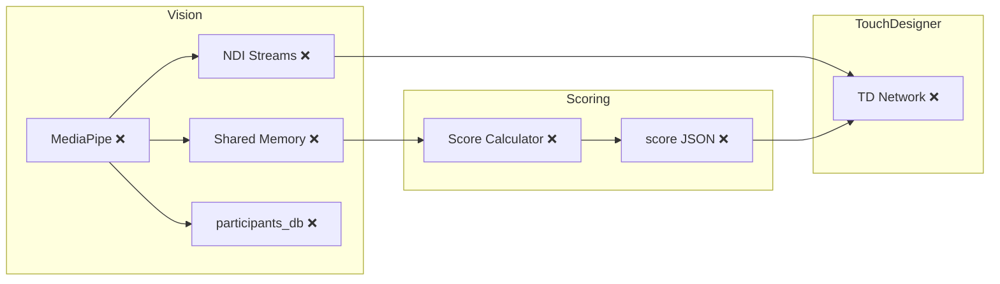

# Session Handoff

**Last updated:** <!-- YYYY-MM-DD HH:MM -->

> **Commands:** "spin up" → claim task & start | "spin down" → update this doc & commit

## Agent Roster
| Emoji | Nickname | Lane |
|-------|----------|------|
| 👁️ | Iris | Vision (MediaPipe → NDI + shared mem) |
| 🎯 | Judge | Scoring (pose → score JSON) |
| 🎨 | Canvas | TouchDesigner (NDI + JSON → visuals) |

## Architecture Status (as of: <!-- YYYY-MM-DD -->)

```mermaid
flowchart LR
    subgraph Vision
        MP["MediaPipe ❌"]
        NDI["NDI Streams ❌"]
        SHM["Shared Memory ❌"]
        DB["participants_db ❌"]
        MP --> NDI
        MP --> SHM
        MP --> DB
    end
    
    subgraph Scoring
        SC["Score Calculator ❌"]
        JSON["score JSON ❌"]
        SHM --> SC
        SC --> JSON
    end
    
    subgraph TouchDesigner
        TDN["TD Network ❌"]
        NDI --> TDN
        JSON --> TDN
    end
```

**Legend:** ✅ done | ⚠️ partial | ❌ not started

## What changed last session
- <!-- keep short -->

## Current state
- **👁️ Iris**: not started
- **🎯 Judge**: not started
- **🎨 Canvas**: TD project copied from archive

## Tasks

### Backlog
- 👁️ Implement MediaPipe multi-person detection + pHash UUIDs
- 👁️ NDI stream output per participant
- 👁️ Shared memory pose buffer writer
- 🎯 Shared memory reader + score calculator
- 🎯 Per-UUID score JSON writer
- 🎨 TD: NDI stream discovery + UUID parsing
- 🎨 TD: Score JSON file watcher

### In Progress
- 🎯 Judge: Shared memory reader + score calculator

### Done
- ✅ Migration: pre_render scripts + TD project from archive

## Blockers
- <!-- delete when resolved -->
